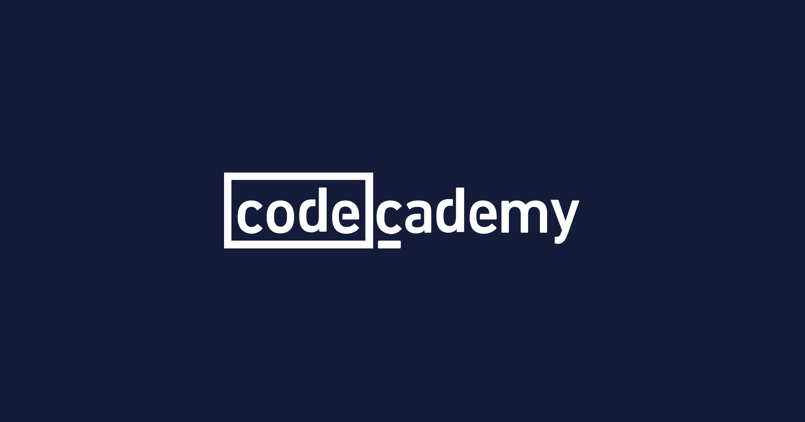

# 📚 **Codecademy Solutions**

## 📗 **Introduction**

This repository is my **personal space** for storing and collecting various projects that I've practiced and built while learning through the [**Codecademy**](https://www.codecademy.com/) platform. Its primary goal is to **track my development**, **showcase my skills**, and **share my unique problem-solving approaches**. Please note, this repository does **NOT** contain *all content* from [Codecademy](https://www.codecademy.com/).

### 🎯 **Purpose & Goals**
This repository is designed to help me:

* **Track Progress** — *Monitor my development* in **problem-solving** and **technical skills**.
* **Deepen Understanding** — *Enhance my understanding* of **Software-focused Programmer** [career paths]().
* **Interview Preparation** — *Strengthen my skills* for **technical interviews** and **continuous learning**.
* **Knowledge Sharing** — *Contribute* to the broader **programming community**.

---

## 💡 **How to Explore**

Follow these **simple steps** to navigate through the solutions:

### **Step 1: Select a Category**

Browse the [**Table of Contents**](#-table-of-contents) to find **categories**.

### **Step 2: Choose a Project**

Each entry provides **essential information**:

* **Project Name** — A *direct link* to the project on [**Codecademy**](https://www.codecademy.com/).
* **Description** — A *brief summary* of what you'll find in that project.
* **Focus Point** — The main *programming languages*, *tools*, or **key concepts** reinforced by the project.
* **Directory Link** — Click "**Open**" to navigate directly to the project's *directory*, which contains the code and related files.

### **Step 3: Explore the Code and Solutions**

Inside each project *directory*, you'll find the **code files** and potentially a **README.md** that provides further details about my **problem-solving approach**.

---

## 📖 **Table of Contents**

This **Table of Contents** primarily covers [**Career Paths**](https://www.codecademy.com/catalog/subject/all), but there's much more to learn on [**Codecademy**](https://www.codecademy.com/), such as **specialized programming languages**. If you're interested, [**click here**](https://www.codecademy.com/).

### Main Categories

* 📂 [**Artificial Intelligence/Machine Learning**]()
* 📂 [**Back-End Engineer**]()
* 📂 [**Computer Science**](#-computer-science)
* 📂 [**Data Engineer**]()
* 📂 [**Data Scientist**]()
* 📂 [**Front-End Engineer**]()
* 📂 [**Full-Stack Engineer**]()
* 📂 [**iOS Developer**]()
* 📂 [**UX Designer Career**]()

> **Note:** This *repository* only reflects the [**career paths**](https://www.codecademy.com/catalog/subject/all) I've studied. [**Codecademy**](https://www.codecademy.com/) offers *many other topics* as well.

---

## 📂 **Computer Science**

Below is a comprehensive list of all **Computer Science** projects available in this repository, designed to build progressive programming skills from foundational Python syntax to advanced software development practices.

| Project Name | Description | Focus Point | Directory |
| :------------------------- | :------------------------------------------------------------------------------------------------------------------------------------------------------------------------------------------- | :---------------------------------- | :---------------------- |
| [**Block Letters**](https://www.codecademy.com/journeys/computer-science/paths/cscj-22-intro-to-programming/tracks/cscj-22-introduction-to-computer-science-career-path/modules/cscj-22-python-hello-world/projects/python-block-letters) | Create ASCII art by displaying your name using block letters made from text characters. | `Python Syntax`, `Print Statements`, `String Formatting` | [**Open**](./computer-science/01-block-letters/) |
| [**Receipts for Lovely Loveseats**](https://www.codecademy.com/journeys/computer-science/paths/cscj-22-intro-to-programming/tracks/cscj-22-introduction-to-computer-science-career-path/modules/cscj-22-python-hello-world/projects/python-furniture-store) | Build a receipt system for a furniture store that calculates prices, taxes, and customer totals automatically. | `Variables`, `Data Types`, `Arithmetic Operations`, `String Concatenation`, `Mathematical Calculations` | [**Open**](./computer-science/02-receipts-for-lovely-loveseats/) |

You can [**click here**](./computer-science/) to see more **Computer Science** projects.

---

### 🙏 **Thank You [Codecademy](https://www.codecademy.com/)**

I want to express my **sincere gratitude** to [**Codecademy**](https://www.codecademy.com/) for their **excellent learning platform**, **quality courses**, and the *opportunity to enhance my coding skills*. The **knowledge and experience** gained from [Codecademy](https://www.codecademy.com/) have **significantly contributed** to creating these projects and **developing my abilities**.